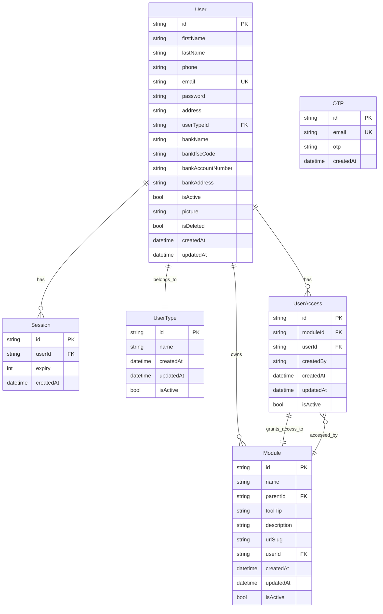
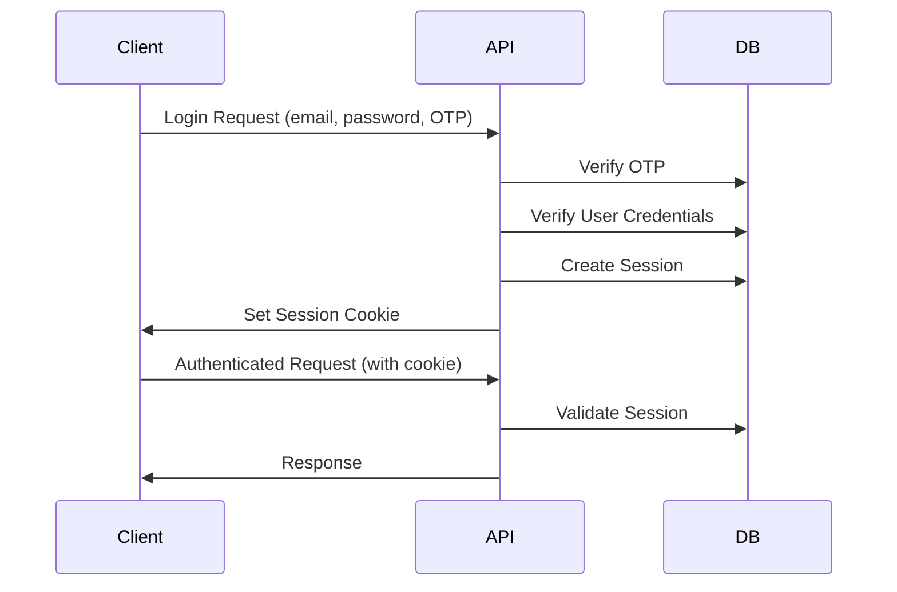

# Superadmin Backend Analysis

## Overview

The superadmin-backend is a Node.js/Express.js application designed to provide administrative functionality for a multi-tenant system. It serves as the backend API for managing users, roles, permissions, and modules within the application ecosystem. The system supports hierarchical user roles (superadmin, admin, manager, user) with role-based access control (RBAC) and includes features like OTP-based authentication, Google OAuth integration, and session management.

Key technologies used:
- **Runtime**: Node.js with ES modules
- **Framework**: Express.js v5.1.0
- **Database**: PostgreSQL with Prisma ORM v5.0.0
- **Authentication**: Session-based with cookie storage
- **Email Service**: Resend API for OTP delivery
- **OAuth**: Google Auth Library for social login
- **Validation**: Zod for request validation
- **Security**: bcrypt for password hashing, express-rate-limit for API throttling

## Architecture

The application follows a layered architecture pattern:

```
┌─────────────────┐
│   Routes        │  (Express routes handling HTTP requests)
├─────────────────┤
│ Controllers     │  (Business logic layer)
├─────────────────┤
│ Services        │  (External integrations: OTP, Google Auth)
├─────────────────┤
│ Models          │  (Data access layer with Prisma)
├─────────────────┤
│ Database        │  (PostgreSQL)
└─────────────────┘
```

### Application Structure
- **app.js**: Main application entry point with Express setup, middleware configuration, and error handling
- **routes/**: Route definitions for user and admin endpoints
- **controllers/**: Request handlers containing business logic
- **middlewares/**: Authentication, validation, and rate limiting middleware
- **models/**: Prisma-based data models
- **services/**: External service integrations (OTP, Google Auth)
- **config/**: Database and setup configuration

### Data Flow
1. HTTP requests enter through routes
2. Middleware validates authentication and input
3. Controllers process business logic
4. Models interact with database via Prisma
5. Services handle external API calls
6. Responses are formatted and returned

## Database Schema

The database uses PostgreSQL with the following entity-relationship model:



### Key Entities

- **OTP**: Stores one-time passwords for email verification
- **Session**: Manages user authentication sessions with expiration
- **UserType**: Defines role hierarchy (superadmin > admin > manager > user)
- **User**: Core user entity with profile and banking information
- **Module**: Represents system features/modules that can be assigned to users
- **UserAccess**: Junction table for user-module permissions

## API Endpoints

### User Routes (`/user/*`)

| Method | Endpoint | Description | Auth Required |
|--------|----------|-------------|---------------|
| POST | `/user/register` | Register new user with OTP verification | No |
| POST | `/user/login` | Login with email/password and OTP | No |
| GET | `/user/data` | Get current user profile | Yes |
| POST | `/user/logout` | Logout current user | No |
| POST | `/user/forgot/password` | Reset password with OTP | No |
| POST | `/user/logout/all` | Logout from all sessions | No |
| POST | `/user/send-otp` | Send OTP to email | No |
| POST | `/user/verify-otp` | Verify OTP code | No |
| POST | `/user/google/login` | Login with Google OAuth | No |

### Admin Routes (`/admin/*`)

#### User Management
| Method | Endpoint | Description | Auth Required | Role |
|--------|----------|-------------|---------------|------|
| GET | `/users` | Get all users | Yes | admin/manager |
| POST | `/admin/logout/user/:id` | Logout specific user | Yes | admin/manager |
| DELETE | `/admin/delete/user/:id` | Soft delete user | Yes | admin |
| DELETE | `/admin/hard/delete/user/:id` | Hard delete user | Yes | admin |
| PATCH | `/admin/recover/user/:id` | Recover deleted user | Yes | superadmin |
| PATCH | `/admin/change/usertype/user/:id` | Change user role | Yes | admin/manager |
| POST | `/admin/users` | Create user | Yes | admin |
| GET | `/admin/users/all` | Get all users (admin) | Yes | admin/manager |
| GET | `/admin/users/:id` | Get user by ID | Yes | admin/manager |
| PUT | `/admin/users/:id` | Update user | Yes | admin |

#### Module Management
| Method | Endpoint | Description | Auth Required | Role |
|--------|----------|-------------|---------------|------|
| POST | `/admin/modules` | Create module | Yes | admin |
| GET | `/admin/modules` | Get all modules | Yes | admin/manager |
| GET | `/admin/modules/:id` | Get module by ID | Yes | admin/manager |
| PUT | `/admin/modules/:id` | Update module | Yes | admin |
| PATCH | `/admin/modules/:id/deactivate` | Deactivate module | Yes | admin |

#### Permissions Management
| Method | Endpoint | Description | Auth Required | Role |
|--------|----------|-------------|---------------|------|
| GET | `/admin/users/:userId/modules` | Get user's modules | Yes | admin/manager |
| POST | `/admin/assign/module` | Assign module to user | Yes | admin |
| POST | `/admin/unassign/module` | Unassign module from user | Yes | admin |
| POST | `/admin/bulk/assign/modules` | Bulk assign modules | Yes | admin |

#### UserType Management
| Method | Endpoint | Description | Auth Required | Role |
|--------|----------|-------------|---------------|------|
| POST | `/admin/user-types` | Create user type | Yes | superadmin |
| GET | `/admin/user-types` | Get all user types | Yes | superadmin |
| GET | `/admin/user-types/:id` | Get user type by ID | Yes | superadmin |
| PUT | `/admin/user-types/:id` | Update user type | Yes | superadmin |
| DELETE | `/admin/user-types/:id` | Delete user type | Yes | superadmin |

## Authentication & Security

### Authentication Methods
1. **OTP-based Authentication**: Email verification using Resend API
2. **Google OAuth**: Social login integration
3. **Session Management**: Cookie-based sessions with expiration

### Security Features
- **Password Hashing**: bcrypt for secure password storage
- **Rate Limiting**: express-rate-limit with different limits for auth (15/min) and admin (100/min) endpoints
- **CORS**: Configurable cross-origin resource sharing
- **Cookie Security**: Signed cookies with httpOnly, secure, and sameSite flags
- **Input Validation**: Zod schemas for request validation
- **Role-based Access Control**: Hierarchical permissions (superadmin > admin > manager > user)

### Session Flow


## Middlewares & Services

### Authentication Middlewares
- **CheckAuth**: Validates session cookies and user status
- **isAdmin**: Restricts access to admin/superadmin roles
- **isAdminOrManager**: Allows admin, manager, or superadmin access
- **isOwner**: Superadmin-only operations
- **isManager**: Manager role validation

### Validation Middlewares
- **validateRequest**: Uses Zod schemas for input validation
- Schemas include: user registration, login, password reset, module creation, etc.

### Rate Limiting Middlewares
- **generalLimiter**: General API rate limiting
- **authLimiter**: Stricter limits for authentication endpoints
- **adminLimiter**: Limits for admin operations

### Services
- **sendOtpService**: Generates and sends OTP via Resend API
- **googleAuthService**: Verifies Google OAuth tokens

## Key Features

### User Management
- Hierarchical role system with permissions
- User registration with OTP verification
- Profile management with banking information
- Soft/hard delete functionality
- Bulk user operations

### Module-based Permissions
- Dynamic module creation and assignment
- Role-based access control
- Hierarchical module structure (parent-child relationships)
- Bulk permission assignment

### Authentication & Security
- Multi-factor authentication via OTP
- Social login (Google OAuth)
- Session management with auto-expiration
- Rate limiting and DDoS protection

### Administrative Controls
- User lifecycle management
- Permission assignment and revocation
- Audit trails (createdBy fields)
- Recovery operations for deleted accounts

### API Design
- RESTful endpoints
- Consistent error handling
- JSON responses with proper HTTP status codes
- CORS support for frontend integration

This backend provides a robust foundation for administrative operations in a multi-tenant application, with strong emphasis on security, scalability, and maintainability.